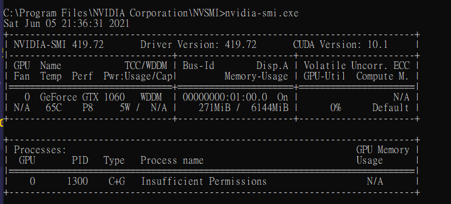
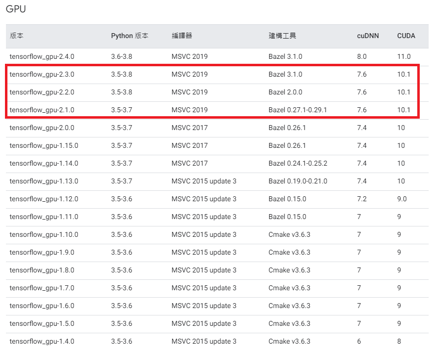

# 一. 安裝anaconda

> 勾選 Add Anaconda to my PATH env. 

```sh
conda update pip
conda install lxml

```

# 二、GPU





- CUDA Version: 10.1
- Select tensorflow_gpu-2.3.0, py version 3.8


```sh
conda create --name tf_1.14 python=3.7
conda env list
conda activate tf_1.14

conda install tensorflow-gpu=1.14

# conda env remove -n tf_1.4

# activate <name>
# deactivate <name>
# conda env remove <name>
```

# Testing Tensorflow

```
conda activate tf_2.3

python
from tensorflow.python.client import device_lib
print(device_lib.list_local_devices())

# [name: "/device:CPU:0"
# device_type: "CPU"
# memory_limit: 268435456
# locality {
# }
# incarnation: 16644056464403519032
# ]
```

---

# YOLOV4 Weight

[下載路徑](https://www.google.com/url?sa=t&rct=j&q=&esrc=s&source=web&cd=&ved=2ahUKEwjhqJHFgIHxAhULwZQKHR3DBMoQFjAAegQIBhAD&url=https%3A%2F%2Fgithub.com%2FAlexeyAB%2Fdarknet%2Freleases%2Fdownload%2Fdarknet_yolo_v3_optimal%2Fyolov4.weights&usg=AOvVaw30if4joxtTaS8DAh12vYQ4)
